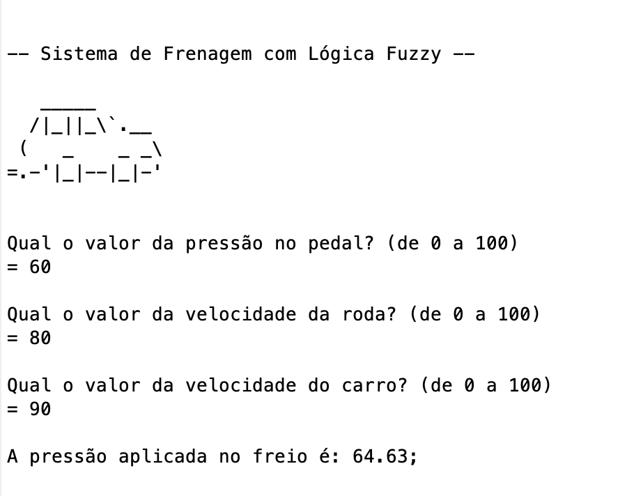

# Sistema de frenagem com Lógica Fuzzy

O projeto se trata de um sistema básico de frenagem utilizando [Lógica Fuzzy](https://pt.wikipedia.org/wiki/L%C3%B3gica_difusa) e foi criado no decorrer da disciplina de Inteligência Computacional do curso de Engenharia de Computação da [Universidade Federal do Ceará (Campus Sobral)](https://sobral.ufc.br/).

## Execução
O projeto foi criado utilizando o **MATLAB R2023b**.  
_O arquivo principal do projeto é o [sistema_de_frenagem.m](sistema_de_frenagem.m)._

## Requisitos
 - [X] Desenvolvido em Scilab ou Matlab
 - [X] Receba três valores:
     - [X] _Pressão no pedal_;
     - [X] _Velocidade da roda_;
     - [X] _Velocidade do carro_;
 - [X] Devolva a _pressão no freio_;
 - [X] Não usar aplicações que realizem diretamente a tarefa, como, por exemplo, o _Fuzzy Logic Designer_ do MATLAB;

A descrição completa do projeto e seus requisitos podem ser encontradas em [Descrição do Projeto.pdf](./Descric%CC%A7a%CC%83o%20do%20Projeto.pdf);

## Demo

## Autores

|  |
|----------------------------------------------------------------------------------------|
| [Robson Mesquita Gomes](https://github.com/rob-ec)                                     |
